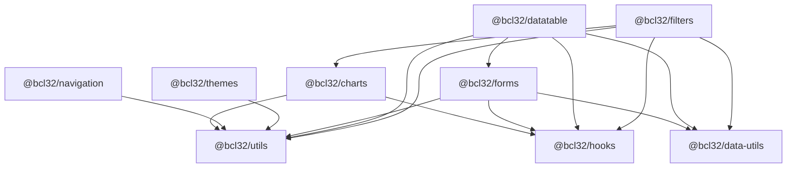

# @bcl32 React Package System — Overview

> **Audience:** Engineers building or consuming the shared React component/data libraries that live under `react-packages/` in the `web-app-monorepo`.
>
> **Scope:** This document is the entry point. It describes *what the system is*, *how the nine packages relate*, *how they are built/versioned/published*, and *how an app consumes them*. Deep dives live in the [sibling docs](#related-documentation).

---

## 1. What the system is

The `@bcl32/*` packages are a set of **nine independently versioned, ESM-only React libraries** published to the GitHub Package Registry under the `@bcl32` scope. They split the concerns of a data-driven CRUD application into composable layers:

- **Presentation primitives** (styled UI components, theming).
- **Pure data utilities** (statistics, sorting, string helpers — no UI, no React).
- **Data-fetching hooks** (TanStack Query wrappers for FastAPI backends).
- **Composite, schema-driven features** (data tables, forms, filters) built on top of the lower layers and driven by a shared `ModelData` / `ModelAttribute` descriptor contract.

### Design philosophy

| Principle | How it shows up |
| --- | --- |
| **Layered, acyclic dependencies** | Packages are organised into tiers (foundational → mid → composite). A package may only depend on lower tiers. The graph is a DAG with no cycles. |
| **Schema-driven, not hand-coded UI** | Tables, forms, and filters are generated from a declarative `ModelData` descriptor (a set of `ModelAttribute` entries) rather than bespoke markup per screen. |
| **Separation of data and UI** | `@bcl32/data-utils` is pure logic with **no React dependency at all**; UI lives in `@bcl32/utils` and the composite packages. |
| **Subpath exports** | Every source file is its own entry point and subpath export (e.g. `@bcl32/utils/Button`), enabling fine-grained imports and tree-shaking. This requires `moduleResolution: "bundler"`. |
| **ESM-first** | All packages emit ESM only (`format: ["esm"]`); consumers must use an ESM-capable bundler (Vite). |

---

## 2. Package tiering

Packages are grouped into three tiers by their position in the dependency graph. A package only ever imports from packages in a **lower** tier (foundational is lowest).

| Tier | Packages | Characteristic |
| --- | --- | --- |
| **Foundational** (Tier 0) | `utils`, `data-utils`, `hooks` | Zero `@bcl32` internal dependencies. The bedrock. |
| **Mid** (Tier 1) | `charts`, `navigation`, `themes` | Depend only on foundational packages. |
| **Composite** (Tier 2) | `datatable`, `filters`, `forms` | Combine foundational + mid packages into full features. |

> Note: `forms` depends only on foundational packages but is categorised as **composite** because it delivers a complete feature (data-driven CRUD forms) rather than a primitive. It is also the only Tier-2 package that `datatable` depends on, so the build resolves it before `datatable`.

### Dependency diagram



ASCII fallback (arrow = "depends on"):

```
Tier 0 (foundational):  utils      data-utils      hooks
                          ▲   ▲         ▲   ▲         ▲  ▲
                          │   │         │   │         │  │
Tier 1 (mid):    navigation │  themes   │   │         │  │
                            │           │   │         │  │
                 charts ────┴───────────┼───┼─────────┘  │   (charts → utils, hooks)
                                        │   │            │
Tier 2 (composite):                     │   │            │
                 forms ─────────────────┴───┴────────────┘   (forms → utils, data-utils, hooks)
                 datatable → utils, data-utils, hooks, forms
                 filters   → utils, hooks, data-utils, charts
```

---

## 3. The nine packages at a glance

| Package | Tier | Version | One-line role |
| --- | --- | --- | --- |
| [`@bcl32/utils`](./01-packages/) | foundational | `2.4.4` | Radix UI + Headless UI + Tailwind component library: styled primitives, layout, and a few data-display utilities. |
| [`@bcl32/data-utils`](./01-packages/) | foundational | `2.1.10` | Pure data-processing utilities (stats, time bounds, grouped counts, datetime sorting, string helpers, form defaults) — no UI, no React. |
| [`@bcl32/hooks`](./01-packages/) | foundational | `2.3.0` | Shared React hooks + fetch utilities wrapping TanStack Query for typed FastAPI access and `ModelData` options enrichment. |
| [`@bcl32/charts`](./01-packages/) | mid | `2.1.6` | Two chart systems: a Bokeh server-rendered line chart and a shadcn-style recharts wrapper (`ChartContainer` + tooltip/legend primitives). |
| [`@bcl32/navigation`](./01-packages/) | mid | `2.1.8` | Context-based navigation-state manager + breadcrumb UI built on `react-router-dom` and `@bcl32/utils` Breadcrumb primitives. |
| [`@bcl32/themes`](./01-packages/) | mid | `2.1.5` | HSL-based theming system: theme provider/persistence, live CSS-variable editor UI, and hex/RGB/HSL colour utilities. |
| [`@bcl32/forms`](./01-packages/) | composite | `2.6.1` | Data-driven CRUD form components (add/edit/bulk-edit/delete) driven by a `ModelData` descriptor, plus standalone field primitives. |
| [`@bcl32/datatable`](./01-packages/) | composite | `2.7.2` | TanStack Table v8 data table with built-in CRUD dialogs, column visibility, selection, virtualization, expandable rows, pagination, plus `KeyValueTable`/`StatsTable`. |
| [`@bcl32/filters`](./01-packages/) | composite | `3.1.2` | Filter-and-chart library: filter context, UI filter controls (text/number/options/datetime), chart drill-down filters, and pure filter data utilities. |

Per-package API reference (key exports, peer deps, usage) lives in [`./01-packages/`](./01-packages/).

### Key exports per package

| Package | Representative exports |
| --- | --- |
| `@bcl32/utils` | `Alert`, `AnimatedTabs`, `TabContent`, `AnimatedFileSystem`, `ShowHierarchy`, `ToggleGroup`, `Dialog`, `DialogTrigger`, … (127 total) |
| `@bcl32/data-utils` | `CalculateFeatureStats`, `ComputeGroupedStats`, `ComputeTimeBounds`, `dayjs_sorter`, `Capitalize`, `Truncate`, `getFormDefault`, types `ModelData`/`ModelAttribute`/`RowData` (14 total) |
| `@bcl32/hooks` | `apiFetch`, `ApiError`, `isApiError`, `useGetRequest`, `useApiMutation`, `useDatabaseMutation`, `useBokehChart`, `useDataLoader`, `useOptionsEnrichment` (11 total) |
| `@bcl32/charts` | `BokehLineChart`, `ChartContainer`, `ChartTooltip`, `ChartTooltipContent`, `ChartLegend`, `ChartStyle`, type `ChartConfig` (9 total) |
| `@bcl32/navigation` | `NavigationProvider`, `useNavigation`, `NavigationBreadcrumb`, type `NavigationEntry` (4 total) |
| `@bcl32/themes` | `ThemeProvider`, `useTheme`, `ThemeDropdownSelect`, `ThemeGenerator`, `ThemePanel`, `ColourConverter`, `ColourPicker`, types `HSLColor`/`RGBColor` (30 total) |
| `@bcl32/forms` | `AddModelForm`, `EditModelForm`, `BulkEditModelForm`, `DeleteModelForm`, `FormElement`, `ButtonDatePicker`, `ColourField`, `RelationCollectionField` (15 total) |
| `@bcl32/datatable` | `DataTable`, `ColumnGenerator`, `RowActions`, `DataTablePagination`, `KeyValueTable`, `StatsTable`, plus low-level `Table*` primitives (16 total) |
| `@bcl32/filters` | `FilterProvider`, `useFilterContext`, `AllFilters`, `DebouncedTextFilter`, `OptionsFilter`, `TimeFilter`, `ChartFilter`, `BarChartFilter` (54 total) |

---

## 4. Build system

All nine packages share a uniform build toolchain.

### tsup (esbuild) configuration

Every package builds with **tsup 8.x** using the same pattern:

| Setting | Value | Why |
| --- | --- | --- |
| `format` | `["esm"]` | ESM-only output. |
| `dts` | `true` | Emit `.d.ts` declaration files alongside JS. |
| `splitting` | `true` | esbuild code-splitting extracts shared chunks into `dist/chunk-*.js`. |
| `sourcemap` | `true` | Ship sourcemaps. |
| `clean` | `true` | Wipe `dist/` before each build. |
| `entry` | one per exported source file | Mirrors the package.json `exports` subpath map → per-file `.js` + `.d.ts`. |
| `esbuildOptions.jsx` | `"automatic"` | No explicit `React` import needed. |
| `external` | `[/^@bcl32\//]` | Sibling packages are **never** bundled in; they resolve at the consumer level. |

Each package also has `prepublishOnly: pnpm run build` as a safety net, though CI always runs `pnpm -r build` explicitly.

### TypeScript

All nine `tsconfig.json` files extend [`../tsconfig.base.json`](../tsconfig.base.json) and add only `include`/`exclude`. The base uses:

```jsonc
{
  "moduleResolution": "bundler", // required so subpath exports (@bcl32/utils/Button) resolve without ambient .d.ts shims
  "target": "ES2020",
  "noEmit": true,                // tsc is a type-checker only; esbuild does the actual emit
  "strict": true,
  "noUnusedLocals": true,
  "noUnusedParameters": true
}
```

`tsc` is used purely for `typecheck`; **tsup/esbuild performs all compilation**.

---

## 5. Workspace, versioning & publishing model

### Workspace protocol

- The monorepo root `pnpm-workspace.yaml` and `react-packages/pnpm-workspace.yaml` enumerate all nine `react-packages/*` directories.
- Inter-package deps use the **`workspace:^X.Y.Z`** protocol, which pnpm resolves to local symlinks during development (never hitting the registry) and rewrites to bare caret ranges in published tarballs.
- `.npmrc` (root and `react-packages/`) sets `link-workspace-packages=true`, `prefer-workspace-packages=true`, and `@bcl32:registry=https://npm.pkg.github.com`.
- **Consumer apps outside the workspace** must use plain `^X.Y.Z` carets — the `workspace:` protocol is invalid to npm in Docker build contexts. (`Base-POC/image-poc-react/` is explicitly *not* in the workspace.)

### Versioning — Changesets

- Managed by `@changesets/cli` (`access: "restricted"`, `baseBranch: "main"`, `updateInternalDependencies: "patch"`). Packages version **independently** (no `fixed`/`linked` groups).
- A **post-commit git hook** auto-generates a patch-level changeset (`.changeset/auto-{hex}.md`) for any commit touching a package directory, then amends the commit to include it. (`PAI_SKIP_CHANGESET=1` prevents amend recursion.) It skips merge commits, CI version commits, and commits that already contain a manual changeset.
- For minor/major bumps, run `pnpm changeset` manually **before** committing (the auto-hook only ever produces `patch`).

### Publishing — CI

CI lives at `react-packages/.github/workflows/publish-react-packages.yml`. On push to `main` that changes `.changeset/**` (or `workflow_dispatch`):

1. Checkout (full history) + Node 18 + pnpm (`pnpm/action-setup@v4`).
2. `pnpm install --frozen-lockfile`.
3. Count pending changeset `.md` files.
4. If present: `pnpm changeset version` (bump versions + CHANGELOGs) → refresh lockfile.
5. `pnpm -r build` (topological order).
6. `pnpm -r publish --no-git-checks` (409s for already-published versions are logged).
7. Commit version changes (`[skip ci]`) and push.

Auth uses `secrets.GITHUB_TOKEN`. Packages publish to `https://npm.pkg.github.com` under the `@bcl32` scope.

### Build / publish order

`pnpm -r build` resolves topological order automatically:

```
Tier 0:  utils, data-utils, hooks
   ↓
Tier 1:  themes, forms, charts, navigation
   ↓
Tier 2:  datatable, filters
```

---

## 6. How an app consumes the packages (high level)

```
┌──────────────────────────────────────────────┐
│  Consumer app (Vite + React 18 + Tailwind)    │
│                                                │
│  package.json:  "@bcl32/datatable": "^2.7.2"  │   (plain caret — NOT workspace:)
│                 "@bcl32/forms":     "^2.6.1"   │
│                 …peers: react, react-dom,      │
│                 @tanstack/react-query, dayjs,  │
│                 recharts, @radix-ui/*          │
└───────────────────────┬────────────────────────┘
                         │ imports
                         ▼
        @bcl32/* (ESM, resolved from GHCR)
```

A consuming app, at a high level:

1. **Installs** the packages it needs as plain caret dependencies (workspace apps resolve to local symlinks; Docker/prod resolve from the GitHub Package Registry via `.npmrc`).
2. **Supplies the peer dependencies** — React 18, `react-dom`, and as needed `@tanstack/react-query`, `dayjs`, `recharts`, `react-router-dom`, and the relevant `@radix-ui/*` packages. Peers are the consumer's responsibility so there's a single copy in the final bundle.
3. **Wraps the app** in the required providers — e.g. a TanStack Query client, `ThemeProvider` (themes), `NavigationProvider` (navigation), and `FilterProvider` (filters) where used.
4. **Describes its domain** with a `ModelData` descriptor (a list of `ModelAttribute`s). That single descriptor drives `DataTable`, the CRUD forms (`AddModelForm`/`EditModelForm`/…), and the filter controls — so a table, its add/edit dialogs, and its filters all stay in sync from one schema.
5. **Bundles with an ESM-capable bundler** (Vite). Because every package is ESM with code-splitting (`dist/chunk-*.js`), the bundler must support ESM dynamic imports for chunk resolution.

> **Heads-up:** inter-`@bcl32` deps are currently declared in `dependencies` (not `peerDependencies`), and several `workspace:^` floor pins lag behind published versions. These are known issues — see [`05-INCONSISTENCIES.md`](./05-INCONSISTENCIES.md) and [`06-REFACTOR-PROPOSALS.md`](./06-REFACTOR-PROPOSALS.md).

---

## Related documentation

| Doc | Contents |
| --- | --- |
| [`./01-packages/`](./01-packages/) | Per-package API reference (exports, peer deps, usage). |
| [`./02-INTEROP.md`](./02-INTEROP.md) | How packages interoperate (the `ModelData` contract, provider wiring, cross-package patterns). |
| [`./03-NEW-PROJECT-GUIDE.md`](./03-NEW-PROJECT-GUIDE.md) | Setting up a new consumer app against `@bcl32/*`. |
| [`./05-INCONSISTENCIES.md`](./05-INCONSISTENCIES.md) | Known inconsistencies, stale pins, and fragile spots. |
| [`./06-REFACTOR-PROPOSALS.md`](./06-REFACTOR-PROPOSALS.md) | Proposed fixes and refactors. |
