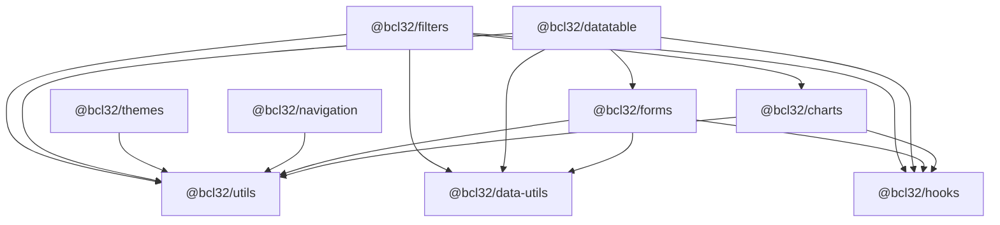

# 02 — Package Interop

How the nine `@bcl32/*` packages depend on one another, how the apps consume
them, and the shared contracts (peer dependencies, version pinning) that keep
the whole graph deduplicated and reproducible.

See also:

- [../00-OVERVIEW.md](../00-OVERVIEW.md) — high-level tour of the package set.
- [../04-apps/](../04-apps/) — per-app consumption details.

---

## 1. Package dependency graph

All nine packages live under `react-packages/` and are members of the pnpm
workspace (`react-packages/pnpm-workspace.yaml`). Internal edges below are the
`@bcl32/*` entries in each package's `dependencies` block — third-party
dependencies are omitted here (see [§4](#4-shared-peer-dependency-contract)).



ASCII fallback (arrows point from dependent → dependency):

```
@bcl32/datatable ── utils, data-utils, hooks, forms
@bcl32/filters   ── utils, hooks, data-utils, charts
@bcl32/forms     ── utils, data-utils, hooks
@bcl32/charts    ── utils, hooks
@bcl32/navigation ─ utils
@bcl32/themes    ── utils
@bcl32/utils     ── (none)
@bcl32/data-utils ─ (none)
@bcl32/hooks     ── (none)
```

### Internal dependency table

| Package | Depends on (`@bcl32/*`) |
| --- | --- |
| `@bcl32/utils` | _(none — leaf)_ |
| `@bcl32/data-utils` | _(none — leaf)_ |
| `@bcl32/hooks` | _(none — leaf)_ |
| `@bcl32/charts` | `utils`, `hooks` |
| `@bcl32/forms` | `data-utils`, `hooks`, `utils` |
| `@bcl32/navigation` | `utils` |
| `@bcl32/themes` | `utils` |
| `@bcl32/datatable` | `utils`, `data-utils`, `hooks`, `forms` |
| `@bcl32/filters` | `utils`, `hooks`, `data-utils`, `charts` |

The graph is acyclic. `utils` is the universal substrate — every non-leaf
package depends on it directly or transitively.

---

## 2. Tier ordering and build order

The packages fall into three tiers based on how deep their internal dependency
chain runs. Tiers exist only to explain ordering; they are not a runtime
construct.

| Tier | Packages | Rationale |
| --- | --- | --- |
| **Tier 0 (leaves)** | `utils`, `data-utils`, `hooks` | No `@bcl32/*` dependencies. `utils` is the UI-component substrate, `data-utils` is pure data/stat helpers, `hooks` is data-fetching/query hooks. |
| **Tier 1** | `charts`, `forms`, `navigation`, `themes` | Depend only on tier-0 packages. |
| **Tier 2** | `datatable`, `filters` | Depend on tier-0 packages plus a tier-1 package (`datatable → forms`, `filters → charts`). |

### Why build order follows the tiers

Each package builds with **tsup** (`build: "tsup"`) emitting ESM + `.d.ts`
bundles into `dist/`. A package's build consumes the **built `dist/` output**
of every `@bcl32/*` package it depends on — both the compiled JS and the
generated type declarations. Therefore a dependency must be built before its
dependents, or the dependent will fail to resolve imports/types.

A valid topological build order is:

```
# Tier 0 (any order, fully parallelizable)
utils  data-utils  hooks

# Tier 1 (after tier 0)
charts  forms  navigation  themes

# Tier 2 (after the tier-1 packages they need)
datatable   # needs forms (tier 1)
filters     # needs charts (tier 1)
```

In practice you do not hand-order this. pnpm computes the dependency graph from
the `workspace:` links and builds in topological order:

```bash
# From the repo root or react-packages/, build every package in dep order
pnpm -r build
```

Because the graph is acyclic, `pnpm -r` always finds a valid order and runs
independent packages in parallel where it can.

---

## 3. Consumer matrix (apps × packages)

Five consumers live in the monorepo. The matrix marks which `@bcl32/*` packages
each app declares as a direct dependency.

| App (path) | utils | data-utils | hooks | charts | forms | navigation | themes | datatable | filters |
| --- | :---: | :---: | :---: | :---: | :---: | :---: | :---: | :---: | :---: |
| **image-poc-react** (`Base-POC/image-poc-react`) | ● | ● | ● | ● | ● | ● | ● | ● | ● |
| **label-designer-react** (`Label-Designer/react`) | ● | | ● | | | ● | ● | | |
| **print-tracker-react** (`Print-Tracker/print-tracker-react`) | ● | ● | ● | ● | ● | ● | ● | ● | ● |
| **security-benchmarks-react** (`Security-Benchmarks/security-benchmarks-react`) | ● | ● | ● | ● | ● | ● | ● | ● | ● |
| **dashboard** (`tools/dashboard`) | | | | | | | | | |

Notes:

- **print-tracker-react**, **security-benchmarks-react**, and **image-poc-react**
  are the heavy consumers — they pull the full data-grid stack
  (`datatable` + `filters` + `forms` + `charts`).
- **label-designer-react** is a lightweight consumer: only `utils`, `hooks`,
  `navigation`, and `themes` (UI shell + theming + nav, no tables/filters).
- **dashboard** (`tools/dashboard`) consumes **no** `@bcl32/*` packages.

### Two different consumption mechanisms

The apps do **not** all consume the packages the same way:

- **Workspace-linked consumers** — `print-tracker-react`,
  `security-benchmarks-react`, and `label-designer-react` declare normal
  semver carets (e.g. `"@bcl32/utils": "^2.5.0"`). With `link-workspace-packages`
  and `prefer-workspace-packages` enabled (see [§5](#5-version-pinning-conventions)),
  pnpm resolves these to the local workspace build when the floor is satisfied,
  and only falls back to the GitHub Packages registry otherwise. Each app also
  carries an `.npmrc` pointing `@bcl32:registry` at
  `https://npm.pkg.github.com`.
- **`@repo/*` file-mounted consumer** — `image-poc-react` (package name
  `time-series`) is **not** a member of the pnpm workspace. It consumes the
  shared packages through a separate `/packages` mount under the `@repo/*`
  alias (`file:`-style local deps), not via `@bcl32/*` registry carets. It is
  listed in the matrix because it uses the same component set, but its wiring
  is independent of the `@bcl32` workspace links.

---

## 4. Shared peer-dependency contract

Cross-cutting libraries (React, dayjs, recharts, Radix, TanStack Query, sonner)
are declared as **`peerDependencies`**, not regular `dependencies`. The app at
the top of the tree supplies a single concrete copy that every package shares.

| Peer dependency | utils | data-utils | hooks | charts | datatable | filters | forms | navigation | themes |
| --- | :---: | :---: | :---: | :---: | :---: | :---: | :---: | :---: | :---: |
| `react ^18.2.0` | ● | | ● | ● | ● | ● | ● ¹ | ● | ● |
| `react-dom ^18.2.0` | ● | | ● | ● | ● | ● | ● ¹ | ● | ● |
| `dayjs ^1.11.10` | ● ³ | ● | ● | | ● | ● | ● ¹ | | |
| `recharts ^2.12.0` | | | | ● | | ● | | | |
| `@tanstack/react-query ^5.18.1` | | | ● | | | | ● ¹ | | |
| `react-router-dom ^6.22.0` | | | | | | | | ● | |
| `sonner ^2.0.7` | | | | | | | ● ¹ | | |
| `@radix-ui/react-dialog ^1.1.1` | ● | | | | ● | | | | |
| `@radix-ui/react-toggle-group ^1.1.0` | ● | | | | | ● | | | |
| `@radix-ui/react-slider ^1.2.1` | ● | | | | | ● | | | |
| Other Radix UI primitives ² | ● | | | | | | | | |

¹ `@bcl32/forms` declares its React / dayjs / TanStack Query / sonner peers
without explicit version ranges (e.g. `"react"`, `"dayjs"`); the dev-dependency
entries pin the matching versions (`@tanstack/react-query ^5.18.1`,
`sonner ^2.0.7`, etc.) so the satisfied range comes from the consuming app.

² `@bcl32/utils` additionally peers on the full set of Radix primitives it
wraps: `react-checkbox`, `react-dropdown-menu`, `react-focus-scope`,
`react-label`, `react-select`, `react-separator`, `react-slot`, and
`react-tooltip` (alongside the dialog/toggle-group/slider rows above).

³ `dayjs` became a peer of `@bcl32/utils` in 2.5.0 — required by the new
`DateTimePicker` component (which formats/parses the selected value as a
`Dayjs`).

### Why peers matter for singleton dedup

These libraries are **stateful singletons** — having two copies loaded at once
breaks the app:

- **React / react-dom** — two React instances throw "Invalid hook call" and
  break context: a provider rendered by the app would not be seen by a hook
  inside `@bcl32/hooks` or `@bcl32/forms` if they bundled their own React.
- **@tanstack/react-query** — `QueryClientProvider` from the app must be the
  same module instance the hooks read from, or `useQuery`/mutations resolve to
  a different (empty) client.
- **react-router-dom** — `@bcl32/navigation` reads the router context created
  by the app's `<BrowserRouter>`; a second router copy sees no routes.
- **recharts / dayjs** — shared chart and date primitives; duplicate copies
  bloat the bundle and can produce subtly inconsistent rendering/formatting.
- **Radix UI primitives** — portals, focus scopes, and open/close state rely on
  shared context; duplicates cause focus-trapping and portal bugs.

Declaring them as peers means each `@bcl32/*` package says "I need _a_ copy of
this, supplied by whoever installs me" rather than bundling its own. The
consuming app (or, for workspace consumers, the hoisted `node_modules`)
provides exactly one copy, which pnpm then dedupes across the whole tree. This
is the crux of the dependency-dedup initiative: keeping these ranges aligned
across every package guarantees a single satisfying version can be hoisted.

---

## 5. Version pinning conventions

### Internal links: `workspace:^`

Every internal `@bcl32/*` dependency is declared with the pnpm
**`workspace:` protocol** plus a caret floor, e.g. inside `@bcl32/filters`:

```jsonc
"dependencies": {
  "@bcl32/utils":      "workspace:^2.5.0",
  "@bcl32/hooks":      "workspace:^2.3.0",
  "@bcl32/data-utils": "workspace:^2.1.10",
  "@bcl32/charts":     "workspace:^3.0.0"
}
```

- `workspace:` forces resolution to the **local package in the workspace**,
  never the GitHub Packages registry, during development and build.
- The `^x.y.z` floor is the minimum version the dependent relies on. On publish,
  pnpm rewrites `workspace:^2.5.0` to a concrete caret range (`^2.5.0`) so the
  published package on the registry carries a normal semver constraint.
- Root and `react-packages/` `.npmrc` both set
  `link-workspace-packages=true` and `prefer-workspace-packages=true`, so even
  app-level plain carets (`"@bcl32/utils": "^2.5.0"`) link to the local build
  when its version satisfies the range.

### App consumption: plain caret

Workspace-member apps declare ordinary caret ranges (no `workspace:` prefix),
which is what gets published/installed for non-workspace contexts:

```jsonc
// Print-Tracker/print-tracker-react/package.json
"@bcl32/charts":     "^3.0.0",
"@bcl32/data-utils": "^2.1.10",
"@bcl32/datatable":  "^2.8.0",
"@bcl32/filters":    "^3.2.0",
"@bcl32/forms":      "^3.0.0",
"@bcl32/hooks":      "^2.3.0",
"@bcl32/navigation": "^2.1.8",
"@bcl32/themes":     "^2.2.0",
"@bcl32/utils":      "^2.5.0"
```

### Why caret floors must be kept honest

The caret **floor** an app (or a dependent package) declares is the minimum it
expects. If a consumer's floor lags behind a feature/export that the package
has since added, two failure modes appear:

- The registry resolves an old version that is missing a newer subpath export,
  producing `Missing specifier` / `is not exported` errors at build time.
- A cached Docker deps layer freezes on the stale install. (See the
  `deps-sync` workflow, which exists to bump consumer carets to the latest
  published versions after a release.)

Keeping the floors convergent with what the deps layer actually installs is the
ongoing maintenance task behind the dependency-dedup work.

### Registry & publishing

All packages set `publishConfig.registry = https://npm.pkg.github.com` and
publish to **GitHub Packages** under the `@bcl32` scope. Each app's `.npmrc`
maps `@bcl32:registry` to that URL with a `${GITHUB_TOKEN}` auth token, so
non-workspace resolution and publishing both target the private GitHub
registry.

---

## See also

- [../00-OVERVIEW.md](../00-OVERVIEW.md) — package-set overview and purpose.
- [../04-apps/](../04-apps/) — per-app consumption and wiring details.
